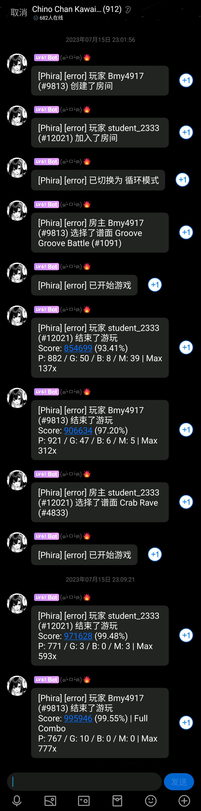

<!-- markdownlint-disable MD033 -->

# serein-phira-broadcast

[Phira](https://github.com/TeamFlos/phira) 多人游戏状态群聊通知 [Serein](https://github.com/Zaitonn/Serein) 插件

## 📖 介绍

### 效果图

点击展开

## 💿 安装

1. 下载 [Serein](https://github.com/Zaitonn/Serein)，然后根据 [文档](https://serein.cc/docs/tutorial/juniorIntro) 配置与连接机器人
2. 将 [phira-broadcast.js](./phira-broadcast.js) 放入 Serein 插件目录并加载
3. 将 [#start.bat](./#start.bat) (Linux 为 [#start.sh](./#start.sh)) 放入 [Phira 多人游戏服务器](https://github.com/TeamFlos/phira-mp) 目录作为 Serein 的启动脚本
4. 开服，大功告成～

## 📞 联系

QQ：3076823485  
Telegram：[@lgc2333](https://t.me/lgc2333)  
吹水群：[1105946125](https://jq.qq.com/?_wv=1027&k=Z3n1MpEp)  
邮箱：<lgc2333@126.com>

## 💡 鸣谢

### [EitherChoice](https://eitherchoice.com/)

- 服务提供

## 💰 赞助

感谢大家的赞助！你们的赞助将是我继续创作的动力！

- [爱发电](https://afdian.net/@lgc2333)
- 

    
赞助二维码（点击展开）

  

  

## 📝 更新日志

暂无
